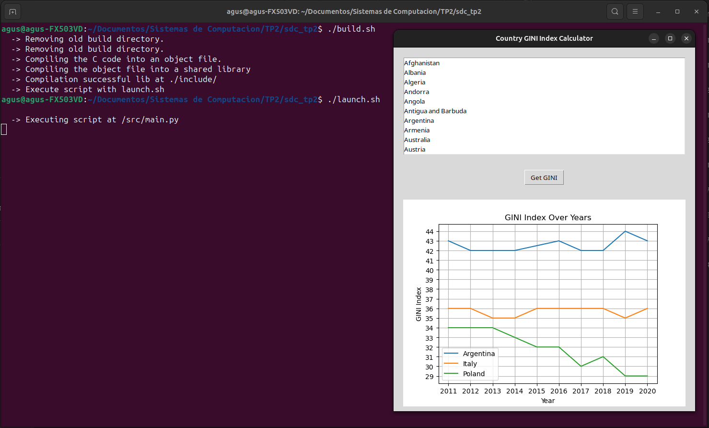
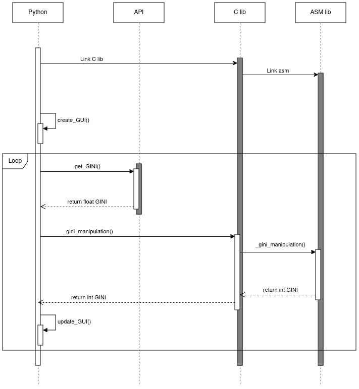

# Sistemas de Computacion
Trabajo Practico 2 - Sistemas de Computacion 

## Stack frame

**Integrantes:**
- [Gil Cernich, Manuel](https://github.com/manugcr/)
- [Pallardo, Agustin](https://github.com/djpallax)
- [Saporito, Franco](https://github.com/fasaporito)

---

## Objetivo

Se debe diseñar e implementar una interfaz que muestre el indice GINI. La capa superior recuperara la informacion del [WorldBank API](https://api.worldbank.org/v2/en/country/all/indicator/SI.POV.GINI?format=json&date=2011:2020&per_page=32500&page=1&country=%22Argentina%22). Se recomienda el uso de API Rest y Python. Los datos de consulta realizados deben ser entregados a un programa en C (capa intermedia) que convocara rutinas en ensamblador para que hagan los calculos de conversion de float a enteros y devuelva el indice de un pais como Argentina u otro sumando uno (+1). Luego el programa en C o python mostrara los datos obtenidos.- 

Se debe utilizar el stack para convocar, enviar parametros y devolver resultados. O sea utilizar las convenciones de llamadas de lenguajes de alto nivel a bajo nivel.

En una primera iteracion resolveran todo el trabajo practico usando C con Python sin ensamblador. En la siguiente iteracion usaran los conocimientos de ensamblador para completar el tp.

**IMPORTANTE: en esta segunda iteracion deberan mostrar los resultados con gdb, para ello pueden usar un programa de C puro. Cuando depuren muestran el estado del area de memoria que contiene el stack antes, durante y despues de la funcion.**

---
## Requerimientos

### Enviroment
En este trabajo buscamos compilar assembler x86 de 32bits sobre Python 3.7 de 64bits, lo cual no es compatible. Una posible solucion encontrada es utilizar un enviroment gracias a conda, la cual nos permite crear y gestionar entornos de desarrollo independientes, lo que facilita trabajar con diferentes versiones de paquetes y dependencias sin conflictos.

Para instalarla se puede seguir los siguientes pasos para un sistema linux, encontrados en la [pagina oficial](https://docs.anaconda.com/free/miniconda/):

```bash
mkdir -p ~/miniconda3
wget https://repo.anaconda.com/miniconda/Miniconda3-latest-Linux-x86_64.sh -O ~/miniconda3/miniconda.sh
bash ~/miniconda3/miniconda.sh -b -u -p ~/miniconda3
rm -rf ~/miniconda3/miniconda.sh
```

Luego de instalarlo hay que agregar la ruta al PATH del sistema, para que se pueda acceder a los comandos de conda desde cualquier lugar. Para ello se debe agregar a `.bashrc` la linea `export PATH="/home/usr/miniconda3/bin:$PATH"`. Una vez agregado se debe actualizar el archivo de configuracion:

```bash
source ~/.bashrc
```

Ya instalado miniconda, se debe crear un enviroment con la version de Python 3.7 32bits y activarlo:

```bash
(base) usr@host:~$ conda create -n py32 python=3.7 -c https://repo.anaconda.com/pkgs/main/linux-32/ --override-channels
(py32) usr@host:~$ conda activate py32
```

Podemos corroborar que nuestro enviroment esta bien configurado ejecutando el siguiente comando:

```bash
(py32) usr@host:~$ python -c "import platform; print(platform.architecture())"
('32bit', 'ELF')
```

Puede ser que tengamos problemas a la hora de instalar las librerias con pip en el nuevo enviroment, para eso hay que actualizar pip con alguno de estos comandos:
```bash
conda update pip
python -m pip install --upgrade pip
```

### Librerias
Para poder ejecutar el programa se necesita tener instalado Python 3.7+ y GCC para poder compilar la libreria en C. Para la segunda etapa del proyecto se necesita tener instalado gdb y nasm para poder compilar el codigo en assembler. Aun que estas herramientas estan instaladas por defecto en la mayoria de los sistemas operativos, se puede instalar con los siguientes comandos:

```bash
sudo apt install build-essential nasm gcc-multilib g++-multilib
```

Las librerias de python necesarias `ctypes`, `tkinter`, `json`, `matplot` `request` son modulos que vienen por defecto en la instalacion de Python. Pero si no estan instalados se pueden instalar con los siguientes comandos:

```bash
pip3 install requests
pip3 install json
pip3 install ctypes
pip3 install tkinter
pip3 install matplotlib
```

En caso de que falle la instalacion de la libreria tkinter, se puede probar en sistemas operativos basados en Debian el siguiente comando:

```bash
sudo apt install python3-tk
```

## Libreria en C
Un archivo `.so` es un archivo de biblioteca compartida, que contiene funciones que pueden ser utilizadas por otros programas, estos archivos son similares a los archivos `.dll` en Windows.

Para poder utilizar una libreria en C desde Python se utilizo la libreria `ctypes`. Esta libreria permite cargar una libreria en C en memoria y poder utilizar las funciones de la misma desde Python. Para ello primero se debe compilar el codigo en C en un archivo `.so` en sistemas linux. Para ello se utilizo el script en bash `build.sh` que ejecuta los siguientes comandos:

```bash
# Compiling the C code into an object file.
gcc -c -m32 -Wall -Werror -fpic ./src/gini_manipulation.c -o ./build/gini_manipulation_c.o

# Assemble the asm file into and object file.
nasm -f elf32 ./src/gini_manipulation_asm.asm -o ./build/gini_manipulation_asm.o

# Link both object files into a shared library.
gcc -m32 -shared -o ./include/libgini.so ./build/gini_manipulation_c.o ./build/gini_manipulation_asm.o
```

Como dijimos anteriormente, la libreria en C se encarga de llamar a una rutina en assembler 32bits, por ello se necesito de nasm y se utilizo la flag `-m32`.

Luego para linkear nuestra libreria `libgini.so` con el script de Python, se deben definir los tipos de entrada y retorno de la funcion en C.

```python
import ctypes
libgini = ctypes.CDLL('./include/libgini.so')
libgini._gini_manipulation.argtypes = [ctypes.c_float]
libgini._gini_manipulation.restype = ctypes.c_int
```

---

## API REST

Las API REST son interfaces que funcionan sobre el protocolo HTTP, aprovechando sus metodos estandar (GET, POST, PUT, DELETE) para realizar operaciones especificas en recursos. Estos recursos pueden abarcar desde datos hasta servicios, brindando acceso a diversos elementos.

En el contexto de esta explicacion, consideremos la interaccion entre el sistema de WorldBank y nuestra aplicacion. Esta API posibilita consultar la base de datos y obtener informacion sobre paises y sus indices.

### Funcionalidades principales de las API REST:

| Metodo  | Descripcion                                                                                           |
|---------|-------------------------------------------------------------------------------------------------------|
| GET     | Utilizado para solicitar datos de recursos especificos. |
| POST    | Se emplea para enviar informacion a la base de datos. |
| PUT     | Utilizado para actualizar informacion en la base de datos.  |
| DELETE  | Se usa para eliminar informacion de la base de datos. |

### Codigos de respuesta HTTP:

| Codigo | Descripcion                                                                      |
|--------|----------------------------------------------------------------------------------|
| 200    | OK. Indica que la solicitud se completo con exito.                               |
| 201    | Creado. La solicitud fue exitosa y se creo un nuevo recurso.                     |
| 400    | Solicitud incorrecta. Se genero un error debido a una solicitud mal formada.     |
| 401    | No autorizado. El cliente debe autenticarse para acceder al recurso solicitado.  |
| 404    | No encontrado. El servidor no pudo encontrar el recurso solicitado.               |
| 500    | Error interno del servidor. El servidor encontro una situacion inesperada.        |


En nuestro caso, hemos utilizado el metodo GET para obtener informacion sobre los paises y sus indices GINI. Esta informacion se obtuvo en formato JSON y se proceso para extraer los datos necesarios. La respuesta incluye una lista de paises con sus respectivos indices, asi como una lista de los diferentes indices de cada año. Para simplificar la presentacion, seleccionamos el indice mas reciente para mostrar en pantalla.

---

## Ejecucion

Para ejecutar el programa se debe correr el siguiente comando desde la carpeta root del proyecto, teniendo en cuenta de estar en un enviroment de **32bits**.

```bash
(py32) ~/sdc_tp2$ sh build.sh
(py32) ~/sdc_tp2$ sh launch.sh

    -> Executing script ...
```

<p align="center">
  <br>
  <em>Fig 1. Ejemplo de ejecucion.</em>
</p>

Como vemos en la Fig 1 se mostrara un menu con la lista de paises disponibles para consultar el indice GINI. Se puede seleccionar diferentes paises y se mostraran los mismos en pantalla, a traves de un grafico en el cual se tiene en cuenta el año y el indice GINI del pais en ese año.

Podemos observar el siguiente diagrama de secuencias para entender el flujo de la aplicacion:

<p align="center">
  <br>
  <em>Fig 2. Diagrama de secuencias.</em>
</p>

Desde python se creo una GUI con `tkinter` para poder seleccionar el pais a consultar. Seleccionado el pais, se realiza la consulta a la API de WorldBank y se obtiene el indice GINI del pais seleccionado. Luego se llama a la funcion de la libreria en C para realizar la conversion de float a entero y se muestra el resultado en pantalla.

Para mayor comodidad a la hora de elegir el pais, se implemento un json con la lista de paises y sus respectivos codigos de pais. De esta forma se puede seleccionar el pais por su nombre y se obtiene el codigo de pais para realizar la consulta a la API, sin necesidad de tener que escribir el pais a buscar.

---

## Stack de memoria

Para el analisis de memoria se utilizo el debugger `gdb` para poder ver el estado del stack antes, durante y despues de la ejecucion de la funcion en C, mediante una interfaz grafica en la cual podemos ver el codigo en C y en assembler.

Este debugger permite ejecutar el programa, poner breakpoints, ver el estado de la memoria y poder ejecutar paso a paso el programa, ya sea saltando de instruccion en instruccion de C con `step` o de assembler con `stepi`.

<p align="center">
  <br>
  <em>Fig 3. Comparacion codigo C y ASM.</em>
</p>

Como podemos ver en Fig 3. se puede ver la comparacion entre cada linea de codigo C con su equivalente en assembler. La declaracion de la variable `result` no se ve explicitamente en el codigo en assembler, ya que en las instrucciones iniciales de assembler se reserva espacio en el stack para esta variable.

<p align="center">
  <br>
  <em>Fig 4. Stack pointer despues de declarar y asignar.</em>
</p>

Luego de ejecutar las lineas 7 y 11 de C, es decir asignar el valor de `gini_index` y de `result` podemos ver el valor del stack pointer en gdb, como se muestra en la Fig 4. 

Como primera instancia se guarda el valor de la variable flotante `gini_index`:
1. `flds -0x1fc4(%ebx)`: Esta instruccion carga el valor de punto flotante almacenado en la direccion de memoria calculada por `%ebx - 0x1fc4` en la pila de la FPU.

2. `fstps -0x10(%ebp)`: La instruccion `fstps` guarda el valor de punto flotante en la pila de la FPU en la direccion de memoria calculada por `%ebp - 0x10`.

Para la segunda instancia en donde se guarda el valor de la variable entera `result` retornado por la funcion `_gini_manipulation`:
1. Se reserva espacio en la pila para almacenar la variable local
2. Se pushea el el contenido el contenido de la posicion de memoria `-0x10(%ebp)` en la pila, la cual hace referencia a nuestra variable flotante `gini_index`
3. Se llama a la funcion `_gini_manipulation` que realiza la conversion de float a entero y suma 1
4. Se guarda el valor de retorno al espacio reservado en la pila para la variable `result`

Como podemos ver en la Fig 4, se ven cuatro unidades de memoria en formato hexadecimal del stack pointer, donde en las ultimas dos unidades se guardan `0x42293333` y `0x0000002b` que son el valor flotante y entero de la ejecucion.

<p align="center">
  <br>
  <em>Fig 5. Estado del stack antes, durante y despues.</em>
</p>

En la Fig 5 podemos observar como los valores de las variables analizadas anteriormente se van guardando en el stack, comenzando el programa con valores que no son relevantes para nuestro caso y a medida que se ejecutan las instrucciones de asignacion el stack se modifica, llegando a nuestros valores finales de `0x42293333` y `0x0000002b`.

---

## Profiling de la aplicacion
El profiling es una tecnica que se utiliza para analizar el rendimiento de un programa y determinar que partes del codigo consumen mas recursos y cuales son las que mas tiempo tardan en ejecutarse. 

En nuestro trabajo se utilizo una llamada a funcion desde una libreria en C sobre Python, con el proposito de mejorar el rendimiento de la aplicacion. Para poder analizar el rendimiento de la aplicacion se utilizo la libreria `timeit` de Python, la cual toma los tiempos de ejecucion de una funcion y los muestra en pantalla.

Como nuestra aplicacion principal se ejecuta desde Python, nos parecio correcto hacer esta medicion sobre el python mismo, y no compararla directamente con la libreria de C.

Para ello creamos una funcion en Python que simula la conversion de un float a un entero, y luego se ejecuta la funcion de conversion de la libreria en C. Se toman los tiempos de ejecucion de ambas funciones y se muestran en pantalla.

```python
# Python equivalent of the C function
def gini_manipulation(gini_index):
    gini_index_int = int(gini_index)
    return gini_index_int + 1
```

```c
// C function 
int _gini_manipulation(float gini_index) 
{
    int gini_index_int = (int)gini_index;
    return gini_index_int + 1;
}
```

```asm
; Assembler function
section .text
    global gini_manipulation_asm

gini_manipulation_asm:
    push ebp
    mov ebp, esp

    ; Convert float to int
    fld dword [ebp+8]
    fistp dword [ebp-4]

    ; Add 1 to the integer
    mov eax, dword [ebp-4]
    add eax, 1

    ; Exit
    mov esp, ebp
    pop ebp
    ret    
```

Al correr el script de profiling para que convierta el numero 42.3 por 1.000.000 de veces consecutivas se obtienen los siguientes resultados:

```bash
~/sdc_tp2$ python3 ./profiling/profiling.py 
  Time taken by C+asm code: 0.698672358004842
  Time taken by C code: 0.7135395390214399
  Time taken by Python code: 0.2677964539907407
```

Como podemos observar los tiempos de ejecucion de la funcion en C es mayor que la funcion en Python, al contrario de lo que se esperaba. Pero creemos que esto se debe a que llamar a una funcion en C desde Python tiene un overhead mayor que llamar a una funcion en Python directamente. Debido a este overhead provocado por una llamada a una funcion muy simple, no parece optimo utilizarla desde Python, pero llegado al caso de que se necesite algo mas complejo es probable que sea mas eficiente llamar a una funcion en C.

Tambien se puede observar que la funcion en assembler es mas rapida que la funcion en C, lo cual es lo esperado ya que el codigo en assembler es mas eficiente que el codigo en C, y no se tiene un overhead en la llamada de C a assembler ya que la libreria esta directamente linkeada con el programa principal.

---

## TO DO

Unit tests:
- Test de validacion de datos de la API
- Validacion de sistema y de usuario

---
## Informacion externa utilizada

- [World countries json](https://github.com/stefangabos/world_countries/tree/master)
- [Miniconda](https://docs.anaconda.com/free/miniconda/)
